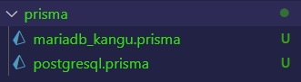
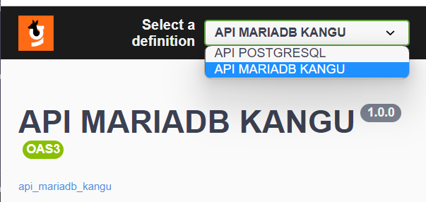
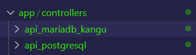

  

# Aplicação NodeJS com Express, Prisma, Swagger, Docker

Esta é uma aplicação que pode ser utilizada como base para a criação de novas aplicações e microserviços distintos que possam estar fora do ambiente monolítico e ao mesmo tempo utilizando suas propriedades, dados e schemas.

É possível através desta aplicação criarmos uma conexão com um banco já existente, puxar os schemas de tabelas que gostaríamos de usá-las e implementar isto em um novo schema que seria consequentemente um outro banco, fazendo assim interações entre eles, criando-se novas bases de dados, porém com dados já existentes do banco de dados atualmente usado ou que esteja atrelado à algum sistema monolítico. Desta forma conseguímos isolar ações e criar novas estruturas de dados sem afetar o banco de dados do monolíto.

# Iniciando a aplicação

É necessário ter o Docker e o docker-compose instalado e rodar o comando abaixo. O sistema está configurado para criar uma imagem docker de um banco de dados Postgresql e ao mesmo tempo ele já conecta ao banco MariaDB usado pelos desenvolvedores <b>(portal-deploy.kangu.equipment)</b>.

- docker-compose up --build

# Arquivos '.prisma'

  

Estes arquivos estão dentro da pasta "./prisma" e são responsáveis pela conectividade e modelagem dos dados que iremos utilizar na aplicação. O sistema está configurado com dois arquivos, são estes:

- mariadb_kangu.prisma:
    - Faz a conexão com o banco já existente. Nele contém a modelagem apenas de uma tabela, sendo isto totalmente flexível.
- postgresql.prisma:
    - Faz a conexão com o banco que será criado a partir da imagem do docker-compose, ele gera o banco caso não exista e já faz a conectividade.

# Selecionando uma definição

  

Cada definição está intrinsecamente atribuída à um controller, os controllers estão dentro da pasta "./app". Portanto cada pasta dentro da pasta "controllers/" representa uma definição no swagger, assim podemos criar diversas definições usando bancos diferentes ou não.

  

